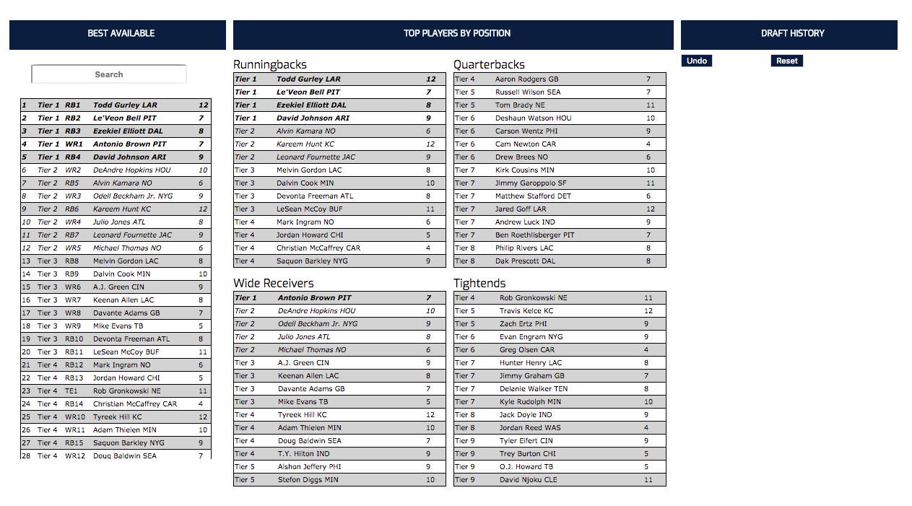

# ArmChair GM 

----

### [Live App]('https://armchair-gm.netlify.com/')

> This app will allow you to draft your next fantasy football team alongside your live draft to have realtime player rankings from FantasyPro's Expert Consensus.
----
### Screenshot

----
### Technology
#### ArmChair-GM is built using the MERN stack. It utilizes React and Redux on the front end and Mongo, Express, and Node.js on back end.
* **ReactJS**
* **Redux**
* **React Router**
* **NodeJS**
* **MongoDB**
* **Mongoose**
* **Express**
* **Passport**

----
### App Features
* Google Authentication/Login
* Search through expert curated player rankings sorting by best overall & best by position as draft picks are made

----

### TODOS
* User Drafted Team is Saved and stored on mongodb
* Rookie players are tracked as sleepers
* After draft grade calculated by weighted position/potential points
* User Team Dashboard displaying team and suggested positions 

